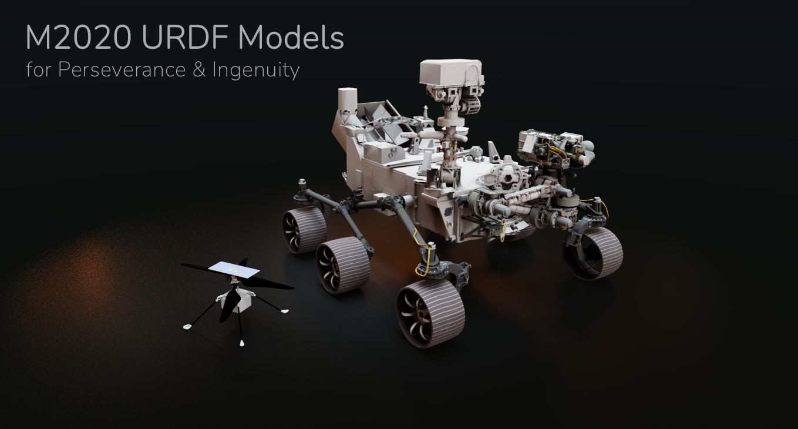

#TRACLabs version:

To use the Rviz simulation of Perseverance/Ingenuity in ROS1:

1. Download this repository in a craftsman workspace.
2. Use the noetic-devel branch
3. Build workspace as usual.

There are launch files for Ingenuity, Perseverance (single and dual):

##01 Perseverance Rover:

```
 roslaunch m2020_urdf_models perseverance_demo.launch
 ```

##02 Perseverance Rovers:

```
 roslaunch m2020_urdf_models dual_perseverance_demo.launch
 ```

##01 Ingenuity Drone:

```
 roslaunch m2020_urdf_models ingenuity_demo.launch
 ```

##02 Ingenuity Drones:

```
 roslaunch m2020_urdf_models dual_ingenuity_demo.launch
 ```

###Original  README:




M2020 Perseverance Rover and Helicopter URDF models used for operations visualization. Models courtesy of the Mars 2020 Perseverance and Ingenuity teams and URDF conversion by JPL RSVP team.

This work was carried out at the Jet Propulsion Laboratory, California Institute of Technology, under a contract with the National Aeronautics and Space Administration

Released June 10th, 2022

Release Ids URS307049, URS309682

Credit NASA/JPL-Caltech

Rover modeling and texturing by Zareh Gorjian

